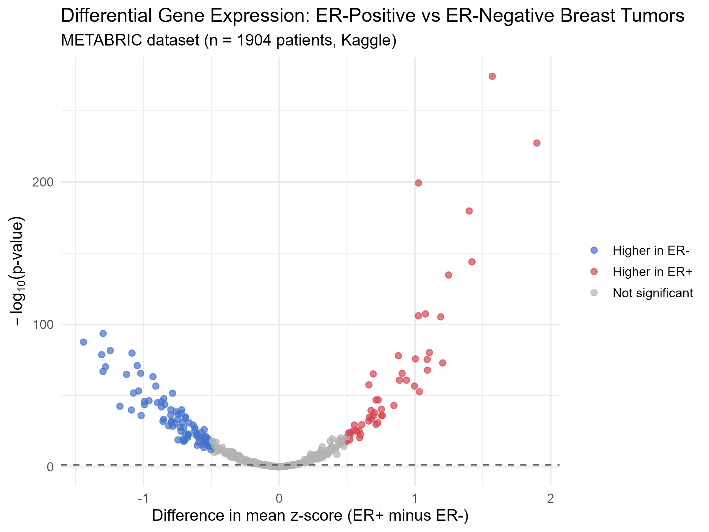

# Breast Cancer Gene Expression Analysis (METABRIC)

## Project Objective

This project explores differential gene expression between ER-positive and
ER-negative breast tumors using the public METABRIC breast cancer dataset
(1,904 patients, sourced from Kaggle). The goal was to practice a full,
reproducible gene-expression analysis pipeline: loading real clinical data
into R, cleaning it, running per-gene statistical tests between two patient
groups, and visualizing the results as a volcano plot.

**Note on the comparison groups:** METABRIC contains only cancer patients
(no healthy/normal controls), so rather than comparing tumor vs. healthy
tissue, this analysis compares two clinically meaningful tumor subtypes:
**ER-positive vs. ER-negative** breast cancer, based on estrogen receptor
status — a real, well-studied distinction in breast cancer biology.

## Data Source

- Breast Cancer Gene Expression Profiles (METABRIC), Kaggle:
  https://www.kaggle.com/datasets/raghadalharbi/breast-cancer-gene-expression-profiles-metabric
- 1,904 patients; mRNA expression given as z-scores for ~331 genes, plus
  clinical attributes and mutation status.

## Pipeline Architecture

1. **Load** (`breast_cancer_analysis.R`) — read the raw CSV with `readr::read_csv()`.
2. **Clean** — isolate the gene-expression-only columns (excluding clinical
   fields and mutation columns), drop genes with missing values, drop
   patients missing ER status, and drop near-zero-variance genes.
3. **Test** — split patients into ER-positive / ER-negative groups and run
   an independent two-sample t-test per gene, recording the difference in
   mean z-score and the p-value for each.
4. **Visualize** — plot all genes as a volcano plot (effect size vs.
   significance) using `ggplot2`, highlighting genes significant at
   p < 0.05.

## Findings

- Genes tested: **489**
- Genes significant at p < 0.05: **348** (out of 489 — a substantial fraction, consistent with ER status being a major driver of expression differences in breast cancer, not a subtle effect)
- Top differentially expressed gene: **MAPT** (delta_z = 1.57, p = 5.25e-275) — on average 1.57 standard deviations more active in ER-positive tumors than ER-negative ones, with a p-value making it essentially impossible for a gap this large to be due to random chance.
- Several of the next-highest hits — **GATA3** and **BCL2** — are well-established, real-world marker genes for ER-positive breast cancer in actual clinical research. Seeing genes with genuine, independently-verified biological relevance rise to the top of a purely statistical ranking — rather than random noise — is strong validation that this pipeline correctly recovered real biology from raw public data.

## How to Reproduce

```r
library(tidyverse)
source("breast_cancer_analysis.R")
```

Requires `METABRIC_RNA_Mutation.csv` (downloaded from the Kaggle link
above) in the same folder.
